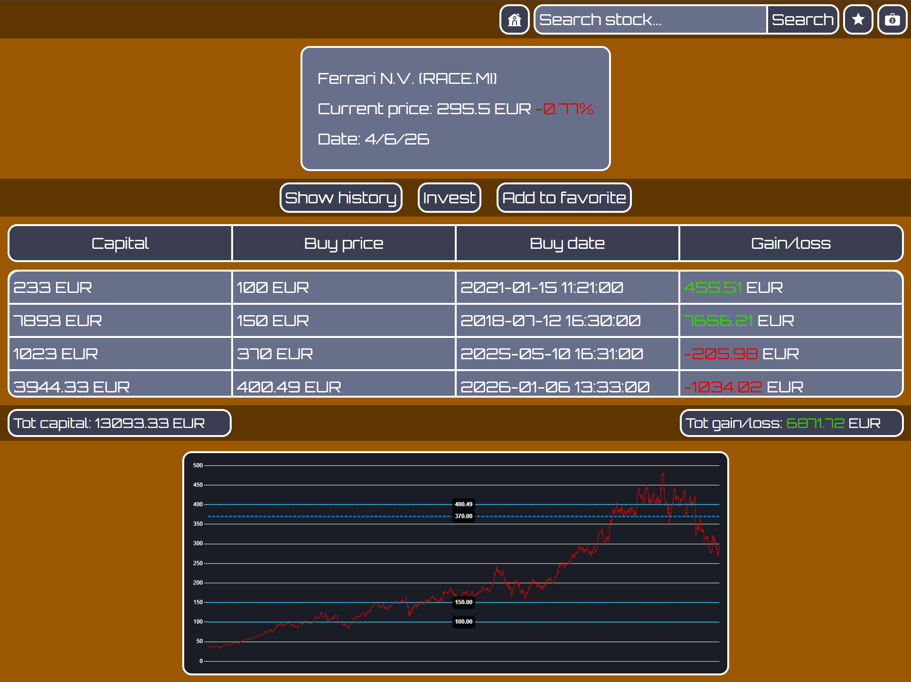
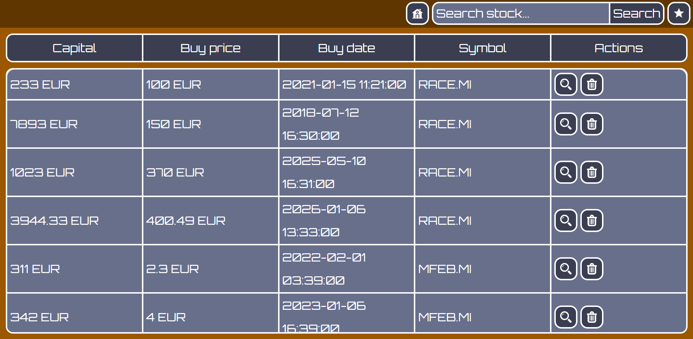
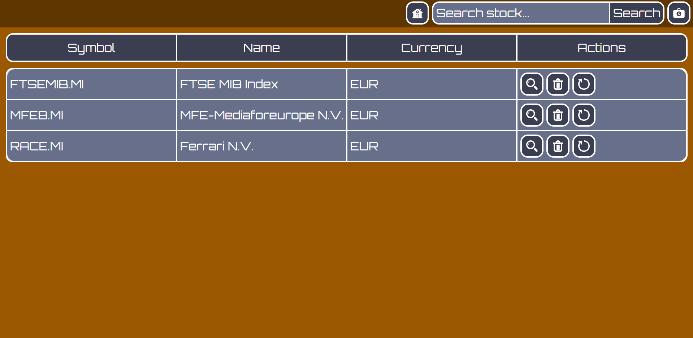

# Stock-Tracking-Web-Application

An application for tracking financial stocks and keep your investments organized.

## Deployment

To deploy this project first install [git](https://git-scm.com/) and [Docker](https://www.docker.com/), then run the command git clone inside a folder of your choosing:

```bash
git clone https://github.com/AndreaVitti/Stock-Web-Application.git

Open the cloned repo and find the folder containing the file **compose.yaml**: there open your terminal and run the following command:

```bash
docker-compose up --build -d
```
This will build the container for the application the just paste this url in your browser: http://localhost:4201

## API Reference

The emptire application centers around the use of this Yahoo Finance endpoint: 

```http
 https://query1.finance.yahoo.com/v8/finance/chart/{SYMBOL}
```

This will return useful data regarding the selected financial stock such as closing price, highest price etc... which will be organize neatly by this app.

## Functionalities

This application features the following:

- current value of a stock
- the % in comparison to the previous closure
- the ability to favourite a stock 
- the ability to store to database the price history of a favourite stock 
- a chart showing a price history and highlights your investments
- othe ability to add and manage investments over various different stocks
- the ability to also visualize bonds
## How to use it

Since it uses Yahoo Finance endpoint to search the desired financial stock it will be require the use of the its correct **SYMBOL** (examples are `RACE.MI` or `MFEB.MI`).  
The application has fundametally 3 tabs:
- a result page
- investment page
- favourite page



This page will display the most relevant info of the financial stock, including a chart with the price history of the its last 10y.  
Creating a favourite will also save its history to database.  
To add an investment simply click the button and fill the form, once finished click invest.



Here you will be able to manage your favourite stock:
- to view it click the magnifying glass
- to remove it click trash can
- to make you the price history remains up to date click the refresh icon



Here you will be able to manage your investments:
- to view it click the magnifying glass
- to remove it click trash can
## Documentation

Once the Docker containers are running, please consult the [OpenAPI](http://localhost:8081/swagger-ui/index.html#/) page to view the backend endpoints.


## Environment Variables

To run this project, you will need to add the following environment variables to your .env file

`POSTGRES_USER`(by default **user**): is the username of the database  

`POSTGRES_PASSWORD`(by default **123456789**): is the password of the database 

`BUCKET_CAPACITY`(by default **6**): is the capacity of the bucket rate limiter

`REFILL_RATE`(by default **5**): is the refill rate of the bucket 

Change them as you see fit.
## Technologies Stack
**Api:** Yahoo Finance

**Database:** Postgres Sql

**Backend:** Spring, Spring Boot

**FrontEnd:** Angular, CSS ,Html 

**Deployment:** Docker

